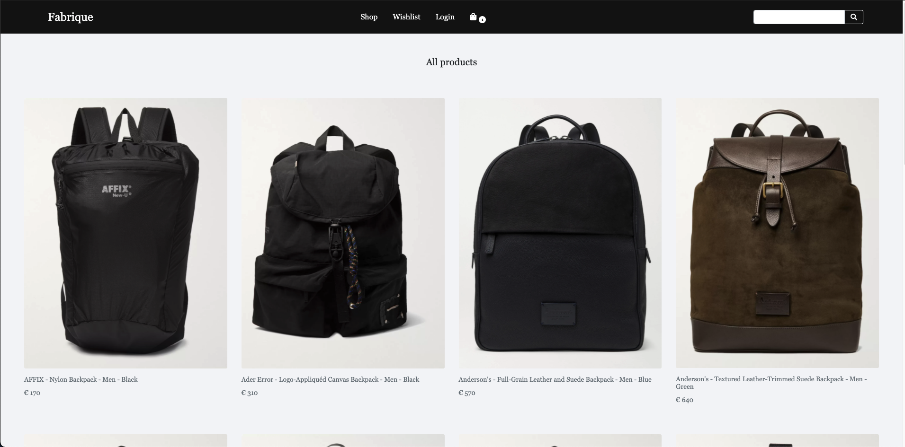

# Fabrique

Fabrique is an ecommerce platform where customers can browse through hundreds of products. Users can login to see their previous orders and manage their account information. The users can also add products to cart and checkout, using stripe payments to purchase the products. Admin staff can log also login and manage all user accounts and products.

[Visit deployed website](https://fabrique-django-react-app.herokuapp.com/)

## Table of Contents

---

- [Fabrique](#fabrique)
  - [Table of Contents](#table-of-contents)
  - [UI/UX](#uiux)
    - [Project goals](#project-goals)
    - [User Stories](#user-stories)
  - [Design](#design)
    - [Color Scheme](#color-scheme)
    - [Typography](#typography)
    - [Images](#images)
    - [Icons](#icons)
    - [Wireframes](#wireframes)
  - [Features](#features)
    - [Existing features](#existing-features)
      - [Navigation](#navigation)
      - [Users login](#users-login)
      - [Registration page](#registration-page)
      - [Homepage](#homepage)
      - [Products Page](#products-page)
      - [Admin Panel](#admin-panel)
      - [User Panel](#user-panel)
      - [Wishlist](#wishlist)
      - [Cart](#cart)
      - [Product Reviews](#product-reviews)
    - [Future features](#future-features)
  - [Database models and schema](#database-models-and-schema)
    - [Models](#models)
    - [Switching from SQLite to Postgres](#switching-from-sqlite-to-postgres)
    - [Diagram](#diagram)
  - [Technologies used](#technologies-used)
  - [Deployment](#deployment)
    - [React Deployment Preparation](#react-deployment-preparation)
    - [Django Deployment Preparation](#django-deployment-preparation)
    - [AWS S3 Bucket](#aws-s3-bucket)
    - [Heroku Deployment](#heroku-deployment)
  - [Testing](#testing)
  - [Defensive Programming and Security](#defensive-programming-and-security)
  - [Performance](#performance)
    - [Lazy Loading](#lazy-loading)
  - [Credits](#credits)
    - [Code](#code)
    - [Images](#images-1)
  - [Acknowledgements](#acknowledgements)

---

## UI/UX

---

### Project goals

The goal of this project was to create an application that would allow users shop for their favourite fashion products. The app allows the user to login or create an account. When the user is logged in they can update their personal details and view past orders. The site also allows the user to view and leave ratings and reviews on any product available on the site. It provides a platform for all the fashion lovers out there to shop until they drop.

### User Stories

As a user I would like to:

-   User experiance

    -   [x] I would like to access the application from both a desktop and mobile browsers.
    -   [x] I would like smooth and easy navigation of the application to view information.

-   Search for products.

    -   [x] I would like to see all the products that are available
    -   [x] I would like to be able to search by category.
    -   [x] I would like to be able to search using a keyword.

-   Account

    -   [x] I would lik to be able to create my own personal account.
    -   [x] I want to be able you update my account information.
    -   [x] I would like to see my previous order details.

-   Shopping

    -   [x] I would like to see the product price and description.
    -   [x] I would like to be notified when I add to cart.
    -   [x] I want to be able to comment on any product on the site.
    -   [x] I want to be able to rate any product on the site.
    -   [x] I would like to be able to checkout easily.

-   Admin
    -   [x] I would like to be able to edit and add products easily.
    -   [x] I would like to be able to delete products.
    -   [x] As the business owner, I would like to have access to an admin section.

---

## Design

---

### Color Scheme

### Typography

-   I have chosen the Goeria font style.
-   The font was downloaded and then imported into my index.css file.
-   Different fone sizes and weights have been used throughout the project.

### Images

-   All images in the project have been obtained from Pexels.com or Unsplash.com. Images have been resized as required.

### Icons

-   Several icons have been used in this project for the navigation and the social media links in the footer. All icons have been obtained from Font Awsome.

### Wireframes

I have created wirefame designs for both desktop and mobile. The file can be found here
[Wirefames](data/Milestone4-Wireframes.pdf).

---

## Features

---

### Existing features

#### Navigation

-   Top navigition bar
    -   This navigation bar provides links to all the pages listed below.
    -   It also contains a search bar that can be used to search the products by keyword.
-   Side navigation bar
    -   The side navigation bar provides links to the product categories.
    -   By clicking on these links, the user will be redirected to the products page. The selected product category will be displayed.

#### Users login

-   Login form for the user to enter their credentials and login in.
-   Submit button with hover effect.
-   Register link to take the user to the registration page.
-   Form fields are all validated by HTML validatoin.

#### Registration page

-   Registration form for the user to sign up and login.
-   Form fields are all validated by HTML validation.
-   The user will have to enter a unique email addess that does not already exist in the database.

#### Homepage

-   Navigation bar with links to each page.
-   React slide show hero component that shows several fashion images.
-   Categories section where each recipe is categorised into specific meals
-   Clickable link images that filter the products by category and display them on the products page.

#### Products Page

-   Products are display in cards to the user.
-   Each card is a clickable link to the product page.
-   The product page displays skeleton loading cards before the response data from the API call is returned.

#### Admin Panel

-   Users page
    -   The users page displays a list of the current users.
    -   Users can be edited and deleted by the admin user.
-   Products page
    -   The products page provides the user with a form to add new products.
    -   The page also lists all the existing products and gives the admin user the option to delete any product.

#### User Panel

-   Profile page
    -   The profile page is available to any logged in user.
    -   The page provide the user with a form for updating their personal details.
    -   The page also displays the users previous orders.
-   Logout

    -   The logout link will logout the current user

#### Wishlist

-   The wishlist page stores any products that the user want to hold before starting the checkout process.
-   The user is provided with a button for sending the products to the cart whenever he/she is ready to checkout.

#### Cart

-   The cart pages holds all the products that the user has added.
-   The user can update the product quantiy or delete products from the cart at anytime.
-   The user is provided with a button to proceed to checkout.

#### Product Reviews

-   The user can rate and leave product reviews for other users to see.
-   The user is limited to one review per product.

### Future features

Several features are missing for this site due to the fact that I ran out of time while developing this project.

-   [ ] Sort products by price
-   [ ] Modal to confirm the deleting of an item
-   [ ] Reset password link
-   [ ] Google login

---

## Database models and schema

---

The database used for this Project was Postgres, as an Installed add-on to the deployed Heroku Application. Sqlite3 was used initially to test the sites performance on a smaller dataset. Mid-development I moved to local & deployed testing so Postgres was used from that point on.

When each app and its models were created and implemented, python manage.py makemigrations was run in the terminal to create the initial model package and python manage.py migrate was then used to apply the model to the database and create the table.

Where possible, first-time-right methodology was approached when creating the models to avoid to many alterations to the models and the database table through multiple makemigrations and migrate commands.

### Models

-   User
    -   This model came from the django.contrib.auth model class. It provided all the inbuilt User object fields.
-   Product
    -   This model holds the information on each product in the store. It has a on-to-many relation ship with the user.
-   Order
    -   This model describes an overview of the order details. It has a on-to-many relation ship with the user.
-   Order Item
    -   This model describes the individual items within an order. It has a on-to-many relation ship with the Order.
-   Shipping Address
    -   This model describes the shipping address the order. It has a on-to-one relation ship with the Order. Each order can only have one shipping address.
-   Review
    -   This model stores the user reviews for each product. It has a on-to-many relation ship with the product.

### Switching from SQLite to Postgres

-   Installed the dj_database_url to utilize the 12factor inspired DATABASE_URL environment variable to configure my Django application.

          pip install dj_database_url

-   Imported the dj_database_url module

        import dj_database_url

-   I replaced the Postgres database URL with the env variable

        DATABASES = {'default': dj_database_url.parse(POSTGRES_URL)

-   To transfer the data from the SQLite database to the Postgres Database I did the following steps:

    -   Connected my manage.py file to my SQLite database.
    -   Used the following command to backup my current database and load it into a db.json file:

            ./manage.py dumpdata --exclude auth.permission --exclude contenttypes > db.json

    -   Connected my manage.py file to my postgres database
    -   Used this command to load my data from the db.json file into postgres:

            ./manage.py loaddata db.json

### Diagram

---

## Technologies used

This ecommerce site was built using the Django REST framework to provide a backend API, to a frontend that uses the React JS framework. The application uses a Postgres database and is hosted on Heroku. The site also uses Amazon AWS S3 buckets to to store the static files and images.

---

-   HTML 5
-   CSS 3
-   Javascript
-   React.js
    -   React bootstrap
    -   React router bootstrap
    -   React Stripe
-   Redux
    -   Thunk middleware
-   Python 3
-   Django and Django extensions
    -   Django
    -   Django Rest Framework
    -   Django Corsheaders
    -   Django Crispy forms
-   Simple JWT
-   Stripe
-   Google fonts
-   Fonts Awesome
-   Git & GitHub
-   Heroku
-   Amazon AWS
-   Adobe suite
-   Google Chrome Developer tools
-   Firefox Developer tools
-   Safari Web Inspector
-   Postman API testing
-   Postgres Database

---

## Deployment

---

---

### React Deployment Preparation

-   Add a Hash Router to deal with SPA routing URL issues.
-   In preparation for deployment I bundled my react files into static assets.

        npm run build

### Django Deployment Preparation

-   In the Django settings the Django templates route has to point to the React build folder.
-   Configure staticfiles_dirs to point to the React static files.

### AWS S3 Bucket

-   I used AWS S3 Bucket to store and serve my static images for the site.

### Heroku Deployment

-   Create a new app on Heroku
-   Connected the new app with the my github repository
-   Set the Heroku environment variables
-   Add the Heroku buildpack (Python beacause we are using Django)
-   Install gunicorn to connect our app to the wsgi file

        pip install gunicorn

-   Create a Procfile and configure the process type for the Dyno

          touch Procfile

-   In the file point to the wsgi

          web: gunicorn backend.wsgi --log-file -

-   Set debug mode to false in the settings.py file

          DEBUG=False

-   Add the allowed hosts to the settings.py file

        ALLOWED_HOSTS = ['fabrique-django-react-app.herokuapp.com']

-   Set static root to server the static files

        STATIC_ROOT = os.path.join(BASE_DIR, 'staticfiles')

-   Run the collectstatic command to bundle all static files into a single directory

        python manage.py collectstatic

-   Install whitenoise to allow Django sever its own static files in production

          pip install whitenoise

-   Add the whitenoise middleware to settings.py

-   Add a project requirements.txt file to store the projects dependency list.

         pip freeze > requirements.txt

-   Add the runtime.txt to indicate the version of python

          touch runtime.txt

-   Final git commit and push to Github
-   In the Heroku GUI click on deploy app.
-   A common error that occurs while deploying is the following

        Error while running '$ python manage.py collectstatic --noinput'

-   The solution to this is to add the DISABLE_COLLECTSTATIC=1 to the Heroku Confin Vars.

## Testing

---

The testing information can be located in the following link.

[Testing file](README_TESTING.md)

---

## Defensive Programming and Security

---

Envirnoment Variables

-   I used the os.environ package to implement my environment variables
-   I created a .env file to store the variables and made sure that it was added to my git ignore file before my first push to Gibhub.
-   When deploying the app to Heroku, I haded to variables to the Heroku Config Vars.

Django REST Permission Classes

-   I used the Django REST frameworks permission classes to define the permission of each user.
-   Permission decorators were added to each view.
-   If any permission check fails an exceptions.PermissionDenied or exceptions.NotAuthenticated exception will be raised.

Authentication

-   I used Simple JWT to provide JSON Web Tokens to authenticate the backend for this project.
-   The web token define a compact and self-contained way for securely transmitting information between parties as a JSON object.
-   The web tokens are stored in the users local storage after logging in.
-   The tokens are also cofigured to last for a 30 day period.

---

## Performance

---

I user the chrome browsers Lighthouse tool to check performance. There were several areas which needed improvement. These are areas that would require future improvement.

### Lazy Loading

I have use the new html "loading=lazy" attribute throughout the app. The loading attribute specifies whether a browser should load an image immediately or to defer loading of off-screen images until for example the user scrolls near them.

---

## Credits

---

### Code

-   Stack Overflow
-   W3Schools
-   MDN Web Docs

### Images

-   Pexels
-   Unsplash
-   Stocksnap

## Acknowledgements

This app was built using React JS and the Django REST Framework. I would like to give a big thanks to all the Django and React community that help developers like myself become better ones.

I would also like to thank the stack overflow community that helped me to solve the issues that I faced throughout this project.

Finally, I would like to thank all the Youtube contributors, providing endless amounts of educational content.
