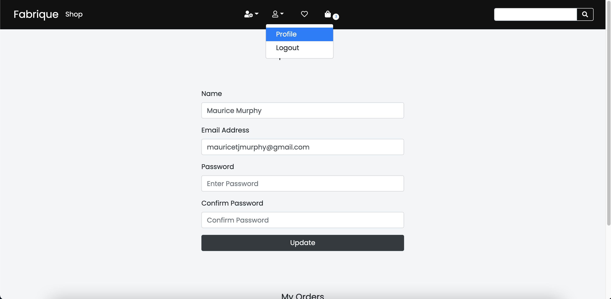

# Testing

## Table of Contents

---

- [Testing](#testing)
  - [Table of Contents](#table-of-contents)
  - [User Stories](#user-stories)
  - [Manual Testing](#manual-testing)
    - [Usability testing](#usability-testing)
    - [Non existing endpoints](#non-existing-endpoints)
    - [Manual](#manual)
    - [Automated](#automated)
      - [Unittesting](#unittesting)
    - [Validators](#validators)
      - [1. HTML5](#1-html5)
      - [2. CSS3](#2-css3)
      - [3. JavaScript](#3-javascript)
      - [4. Browsers](#4-browsers)
      - [5. Responsivness](#5-responsivness)
      - [6. Form Validation](#6-form-validation)
  - [Unit Testing](#unit-testing)
    - [Django REST API test cases](#django-rest-api-test-cases)
  - [Defensive Programming](#defensive-programming)

---

## User Stories

---

-   Search for products.

    -   [x] I would like to see all the products that are available.
    -   [x] I would like to be able to search by category.
    -   [x] I would like to be able to search using a keyword.
            

    -   The site provides the user a side navigation bar where the user can either select all categories or a specific category. The user is also provided with a search bar in the top navigation bar that he/she can use to search by keyword, through the products.

-   Account

    -   [x] I would like to be able to create my own personal account.
            
    -   Users can click on the account icon in the navigation bar to either login or register if they are not already an existing user. The user will also be prompted to login or register to complete the checkout process.

    -   [x] I want to be able you update my account information.
            
    -   Users can update their profile by navigating to their profile page. This icon will show when the user is logged in.
    -   [x] I would like to see my previous order details.

-   Shopping

    -   [x] I would like to see the product price and description.
            
    -   Users can click on any product and they will be redirected the the product page. The user will now be able to view more information on the product and also add it to their wishlist or directly to the cart.
    -   [x] I would like to be notified when I add to cart.
            
    -   When the user adds items to their cart the number of items is updated and displayed in the navigation bar.
    -   [x] I want to be able to review any product on the site.
    -   [x] I want to be able to rate any product on the site.
            
    -   Ueser can leave rating and reviews by using the form on the product page of each product. The user is limited to one review per product.
    -   [x] I would like to be able to checkout easily.
            
    -   On the cart page the user can review all their products, update them or click on the checkout button to begin the check out process.

-   Admin
    -   [x] I would like to be able to add products in bulk.
            
    -   [x] I would like to be able to delete products.
            
            The admin user when logged in, will be able to access the products page. From here the admin user will be able to delete any product.
    -   [x] As the business owner, I would like to have access to an admin section.
            
    -   When an admin user logs in they will have access to the admin panel. From here they will be able to manage users and products.

---

## Manual Testing

---

### Usability testing

Useability testing for this website was achieved by sending a live link of the site to a selected group of people and setting them a number of navigation tasks to carry out. Users reported that they could easily accomplish their tasks and navigate seemlessly through the site.

### Non existing endpoints

I have added custom 404 and 500 error pages

### Manual

1. Register

    - Tested to submit the signup form with blank fields. Received the error "This field is required".
    - Tested to register with an incorrect email address format. Received the error "Please enter a vlaid email.

2. Login

    - Tested to submit the login form with blank fields. Received the error "This field is required".
    - Tested to submit a form with a user detail that do not exist in the database. Flash message warns the user to check username and password

3. Recipe Form

    - Tested to submit empty form and verify that no recipe has been added to any category page.
    - Tested to submit filled out form with data in all fields.
    - Tested to submit the form with empty fields. Some fields have been intenionally left open to blank data.

4. Update Recipe

    - Tested to change some data on the form and resubmit the form.
    - Tested to submit filled out form with data in all fields.
    - Tested to submit the form with empty fields. Some fields have been intenionally left open to blank data.

5. Delete Recipe

    - Tested to delete a recipe.
    - The delete button opens a modal that asks the user if they would like to delete or not.

6. Logout

    - Tested the logout route
    - If the user is logged out the Flask-login "@Login_required" redirects the user back to the login page and displays a flash messages to say that login is required.

### Automated

#### Unittesting

Automated testing was carried out on specific parts of the application. Python comes with a built in set of tools and libraries that can be used to test for your application.

I mainly trsted the http routes and checked for a 200 success response. I also tested for specific response data on all routes. Flask-login auth blocked the test response so I temporarily disabled the @Login_required decorators before running the tests.

All tests can be found in the test_app.py file.

### Validators

#### 1. HTML5

-   W3C HTML Validator
    -   Document checking on HTML. All warning that remain are related to the Jinja templating and cannot be avoided.

#### 2. CSS3

-   W3C CSS Validator
    -   No errors found

#### 3. JavaScript

-   JsHint Metrics

    -   There are 5 functions in this file.
    -   Function with the largest signature take 0 arguments, while the median is 0.
    -   Largest function has 6 statements in it, while the median is 3.
    -   The most complex function has a cyclomatic complexity value of 2 while the median is 1.

-   Warnings
    -   'template literal syntax' is only available in ES6 (use 'esversion: 6').

#### 4. Browsers

-   The app was tested on the four most used browsers Chrome, Safari, Internet Explorer and Firefox, according to W3Counter. The main testing was done with the Chrome DevTools.

#### 5. Responsivness

-   Responsive design was factored in during the design of the app. This was achieved with a combination of Bootstrap, CSS Grid, CSS Flexbox and media queries. The media queries changed the screen layout as the screen size changed.

#### 6. Form Validation

All form fields in this projct are validated using flask wtf form validators. Any form field not using WTF validation, will contain the HTML ‘required’ property for validation. By catching invalid data on the client-side, the user can fix it straight away.

## Unit Testing

---

### Django REST API test cases

---

## Defensive Programming

---
